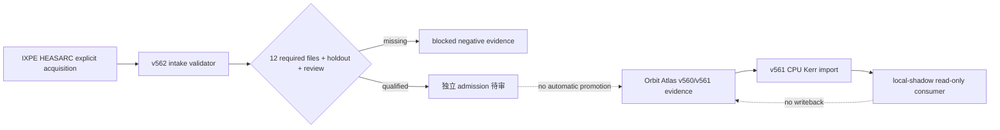

# Orbit Atlas v562 技术状态与后续路线

## V562 active-candidate update (2026-08-02)

The active current-worktree gate now consumes a qualified sparse Kerr polarization reference from `E:\86137\myai\orbit-relativity-engine`.

- `transport` uses a full Boyer–Lindquist affine geodesic plus parallel-transport DOP853 solve; the former Mino/affine mixing was removed.
- Walker–Penrose uses the oriented Carter Killing–Yano form and the inverse-metric Hodge dual. The declared capture boundary is `max(r_horizon + 0.20 M, 2.50 M)`; this is explicitly not horizon-resolved transport.
- Default five-ray replay: WP relative drift `4.50e-9`, null drift `3.08e-9`, polarization orthogonality drift `4.82e-10`, DOP853/RK45 EVPA difference `2.22e-9 rad`; all rays terminate as `captured-boundary` or `escaped`.
- The extended sparse benchmark covers Schwarzschild equatorial/axisymmetric limits, Kerr prograde/retrograde cases, 12 spin/inclination/observer-distance convergence cells, tolerance sensitivity, deterministic replay and an 80-digit `f_theta=1/r` oracle (`5.58e-11` relative error).
- New artifacts are isolated in `orbit-relativity-engine/dist/transport-v562` and imported into `dist/science/orbit-relativity-engine-v561`; the old `dist/transport/transport-blocked.json` remains historical negative evidence.
- `measuredAuthorityGranted=false`, `radiative-transfer=blocked`, `dense=0/49`, GPU shadow is not run, and formal product pointer remains `v263` with default kernel `legacy-eih-1pn`.

The explicit IXPE metadata pass remained payload-free and returned `blocked-metadata-identity-conflict`: HEASARC metadata returned HTTP 404 and the NASA mirror ended with TLS EOF. No retry or target replacement was attempted. The 8 GiB standalone build reached the policy heap maximum and produced a resource-blocked receipt; rollback slots and content packs were restored, so browser/soak/dense/GPU gates were not started. Active release gate SHA: `5e42f8544a19393f228183c4a954edcbf34d42a3699ec93b3d70c60f86b78995`.

The first four v562 visual hero scenes are now a single-Canvas-compatible SVG/DOM overlay: Kerr volume disk, photon-ring lensing, Science polarization direction-field, and Science/Cinematic A·B. They share deterministic scientific geometry, pin the v562 KTX2-first manifest SHA, keep Science linear with no post-FX, and set cinematic writeback to false.

## 当前交付

v560/v561 的冻结边界保持不变：正式产品仍为 `v263`，默认 kernel 仍为
`legacy-eih-1pn`，dense 仍为 `0/49`，v559 的一个历史 source drift 只被记录为
负证据，未重写历史 SHA。

### v561 证据收敛

- 当前工作树重验证：24/24 current source manifest entries match。
- v559 historical drift：1 mismatch，历史 evidence 未修改。
- v560 light verifier、双 reseal、pointer/evidence/artifact SHA 链通过。
- TypeScript/Python canonical hash 已统一为 `orbit-canonical-json-v1-number-e16`；
  Python 配置 SHA 会由 Node importer 独立复算。

### Orbit Relativity Engine

独立 sibling：`E:\86137\myai\orbit-relativity-engine`。

- CPU float64 authority；DOP853 Carter-separated null rays。
- Schwarzschild photon sphere/ISCO、Kerr prograde/retrograde ISCO、critical curve。
- 输出 HDF5、FITS、JSON、PNG，并携带 engine/config/source manifest 与 SHA。
- `verify` 现在检查 null constraint、势函数违反量、状态守恒、解析 benchmark、
  HDF5/FITS round-trip 与 deterministic replay。
- 当前 reference artifact 为 5 rays；GPU、GRMHD、偏振 transport、辐射转移和 measured
  authority 均明确保持 blocked。

### IXPE measured lane

第一条实测链固定为 IXPE/HEASARC，默认目标固定为 Cyg X-1。v562 已交付：

- 12 文件输入合同：event list、attitude、ARF、RMF、polarization response、background、
  observation metadata、calibration manifest、detector identity、provenance、holdout、reviewer attestation。
- 明确单位/时间系统、detector identity、calibration/science 分离、许可证、SHA、独立 holdout、
  response replay 和 mutation audit 门禁。
- `scripts/acquire-ixpe-public-data-v562.py` 默认 dry-run；只有显式 `--execute-network` 才执行
  一次 HTTPS 请求，不自动重试、不自动换目标、不写 expected counts。
- 当前 staging 为 `0/12`，已生成可复验 blocked negative evidence；`measuredAuthorityGranted=false`。
- Atlas 路由和页面只在 `local-shadow` 提供，普通 standalone/lite fail-closed。

## 验证结果

通过：

- Orbit Relativity Engine `pytest`：11 tests。
- Atlas v561/v562 focused Vitest：8 files / 15 tests。
- `npx tsc --noEmit`。
- 新增 v561/v562 目标文件 ESLint，`--max-warnings=0`。
- v560 light、v561 revalidation、engine import、v562 IXPE verifier。

现有工作树阻塞（未由本轮引入）：

- `npm run test:atlas`：671/674 通过；3 个纹理/content-pack 文件已在任务开始前被删除。
- 全量 Vitest：3,251/3,318 tests 通过；包含误由 Vitest 直接收集的 Playwright suites、缺失
  `middleware.ts`、历史 source drift、视觉资源缺失等既有问题。
- `npm run lint -- --max-warnings=0`：既有 83 warnings 与 1 个 `no-assign-module-variable` error。
- `npm run build`：默认 4 GiB 与单次 6 GiB Node heap 均 OOM；没有继续提高内存，也未启动 browser、GPU 或 dense。

## 后续执行顺序

1. 先补齐/确认被删除的纹理、middleware、历史 source manifest，并恢复 full focused gate；不改 frozen v263/v560 evidence。
2. 在获得真实 IXPE 公共包后，只运行显式 acquisition，完成 SHA/单位/响应/holdout/reviewer admission；
   数据不全继续保持 blocked。
3. 完成独立 Walker–Penrose 与 parallel-transport oracle，再解除 engine `transport` blocked。
4. 几何与 transport 通过后实现 Stokes I/Q/U/V、thermal/non-thermal synchrotron、Faraday 和 disk/jet，
   继续保持 measured/model 严格分离。
5. 最后才排队 49/49 CPU dense、GPU shadow differential、Playwright/soak 和 20%–30% 的 Science/Cinematic
   美术线；在此之前不执行 dense、生产部署或 Git stage/commit。
